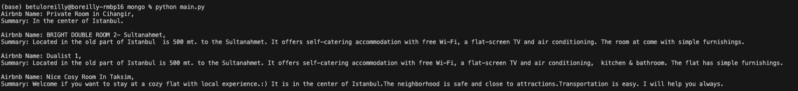

## Atlas Vector Search

Using MongoDB Atlas' Vector Search engine, we store dense vectors and calculate similarities all within the data storage layer.


### 1. Install Dependencies

``` shell
pip install sentence_transformers, pymongo
```

### 2. Import Libraries
We'll be using a popular pre-trained sentence transformer model. You can alternatively train your own or re-train an existing one.

``` python
from sentence_transformers import SentenceTransformer
import pymongo

# import the embedding model
# https://huggingface.co/obrizum/all-MiniLM-L6-v2
model = SentenceTransformer('obrizum/all-MiniLM-L6-v2')

# mongo connection
mongo_uri = ""
connection = pymongo.MongoClient(mongo_uri)
db = connection.sample_airbnb
collection = db.listingsAndReviews
```

### 3. Prepare Embedding
Convert each airbnb summary into its' corresponding vector embedding, then replace the document it in the vector database.

``` python
for doc in collection.find({'summary':{"$exists": True}}):
    embeddings = model.encode(doc['summary']).tolist()
    doc['embedding'] = embeddings
    collection.replace_one({'_id': doc['_id']}, doc)
```


### 4. Create Vector Index
We use the default [HNSW](https://github.com/esteininger/vector-search#similarity-search) KNN index structure when we create our field mapping definition:

```json
{
    "mappings": {
        "dynamic": true,
        "fields": {
            "embedding": {
                "dimensions": 384,
                "similarity": "dotProduct",
                "type": "knnVector"
            }
        }
    }
}
```

### 5. Calculate Similarity
The heart of vector search is in the similarity calculation. 
Here we use [dotProduct](https://en.wikipedia.org/wiki/Dot_product) but you can experiment with others.

```python
query = "central place in Istanbul"
vector_query = model.encode(query).tolist()
results = collection.aggregate([
    {
        '$search': {
            "index": "summarysearch",
            "knnBeta": {
                "vector": vector_query,
                "k": 4,
                "path": "embedding"}
        }
    }
])


for document in results:
    print(f'Airbnb Name: {document["name"]},\nSummary: {document["summary"]}\n')
```
###  Result:


 
