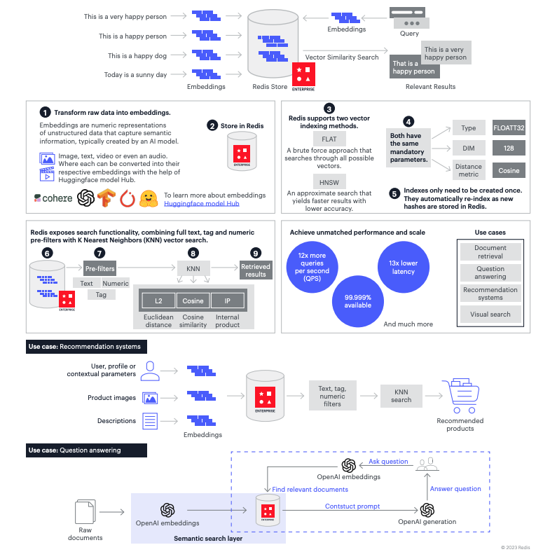
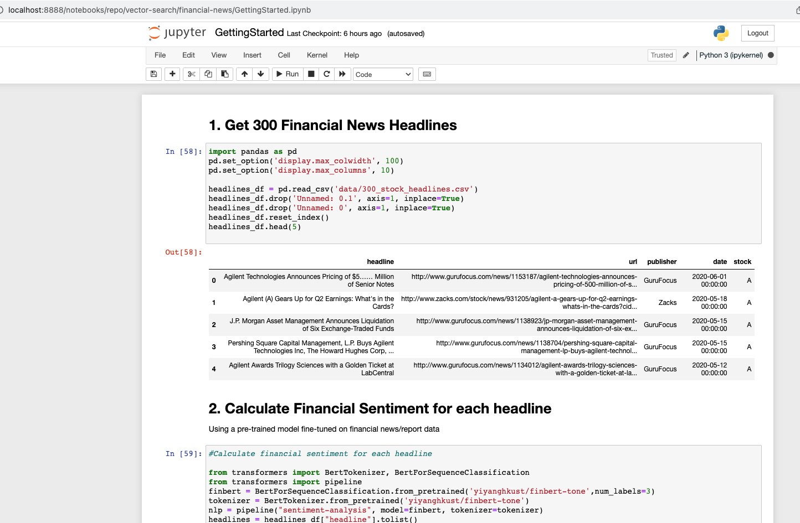

# Vector sheet  

 

# Fire Up the Docker containers
Use docker-compose to start up 2 containers:
* vesim: A redis container with Vector Similarity Search (VSS Private Preview) on port 6379
* jupyter: A python notebook server on port 8888
    
```
cd redis
docker-compose up
```
 
# Launch the Jupyter Notebook

Then open the "GettingStarted" notebook.



 